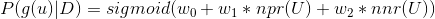
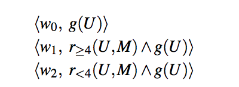
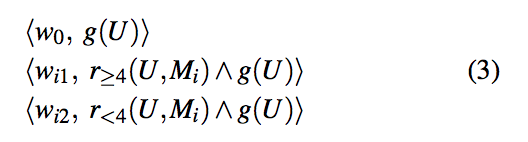
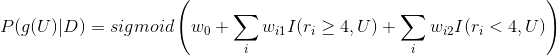
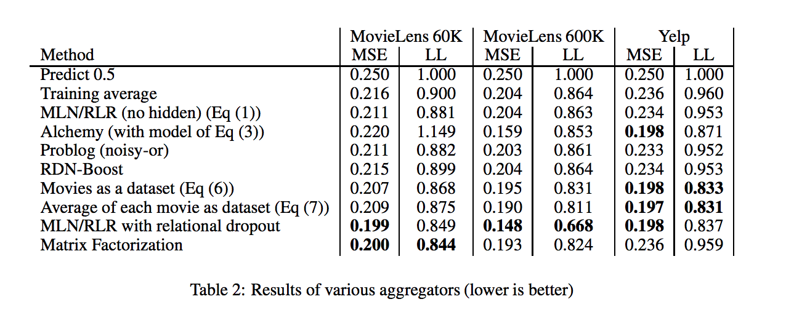

# Aggregators in Relational Probabilistic Models

Given a user's rating to a movie, how can we predict the user's gender? We can use a simple logistic regression model to solve this problem: 

  

where g(U) is the gender of user U, npr(U) is the number of positive rating from user U and nnr(U) is the number of negative ratings from user U (a rating is between 0 and 10 and is considered negative if it is below 4). D is the dataset and w0, w1, w2 are parameters to be learned.

The above logistic regression model can actually be represented using a simple Markov Logic Network (MLN) [Domingos and Lowd 2009]:

<figure>
  
  <figcaption>The above image is taken from equation (1) in [Kazemi et al 2017] </figcaption>
</figure>

MLN is a relational model which uses a set of weighted formulas to model the joint distribution of user's gender and ratings. In the above MLN, w0, w1, w2 correspond to the weights of 3 formulas. The first formula is true if a user is female. The second formula is true if a user is female and gives a rating larger than or equal to 4 to (any) movie. This shows the connection with the logistic regression model that we considered earlier. 

This model is not going to predict well, because the aggregator is too simple. We show a more complicated aggregator below.

<figure>
  
  <figcaption>The above image is taken from equation (3) in [Kazemi et al 2017] </figcaption>
</figure>

In this MLN, we have two formulas for each movie. For example, the second formula in the above MLN evaluates to true if a user is female and she gives a rating larger than or equal to 4 to movie i. Obviously, we are aggregating more information on a user's gender here than the first MLN. 

The above MLN can be interpreted probabilistically as:

  

where I is an indicator function that returns 1 if a user U gives a certain rating (larger or smaller than 4) to a movie i. We can optimize this MLN using stochastic gradient descent and this is exactly what `mln_direct_LR_wgt_for_each_item.py	` does.

It turns out that this model has better performances than other baselines on tested datasets. Here is the empirical result:
|Method                | ml-60k ASE | ml-60k log loss | ml-1m ASE | ml-1m log loss | Yelp ASE | Yelp log loss |
-----------------------|------------|-----------------|-----------|----------------|----------|---------------|
|MLN (weight per movie)|    0.187   |     0.809       |    0.135  |       0.606    |    0.187 |      0.792    |

Here is the empirical results of other baselines:

  

This result is from Table 2 in [Kazemi et al 2017]. ml-60k and ml-1m are movie ratings datasets. In the Yelp dataset, we predict a restaurant's cuisine type given user's ratings. 

It's hard to explain why the second MLN (weight per movie) has better performances than methods like matrix factorization in the above table. But it is clear that the second MLN has a better performance than the first naive MLN (with results in the third row of the above table), and this could be explained by the better aggregating ability of the second MLN.  

### References
[Kazemi et al 2017] Comparing aggregators for relational probabilistic models. arXiv preprint arXiv:1707.07785

[Domingos and Lowd 2009] Markov Logic: An Interface Layer for Artificial Intelligence. Synthesis Lectures on Artificial Intelligence and Machine Learning, Morgan and Claypool.
